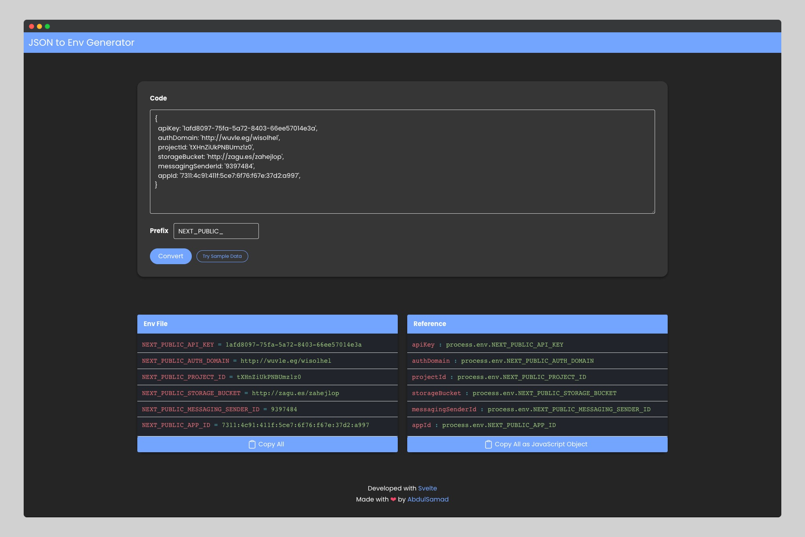

## JSON to Env Generator
JSON to Env Generator to convert a JSON config into .env with an optional prefix and reference. You can paste a config object (e.g firebase config) and it will output you the environment variables and javascript reference for environment variables.

I have completely rewritten this application from scratch using Svelte. Svelte is a modern JavaScript framework that allows us to build powerful, reactive web applications with minimal code.

