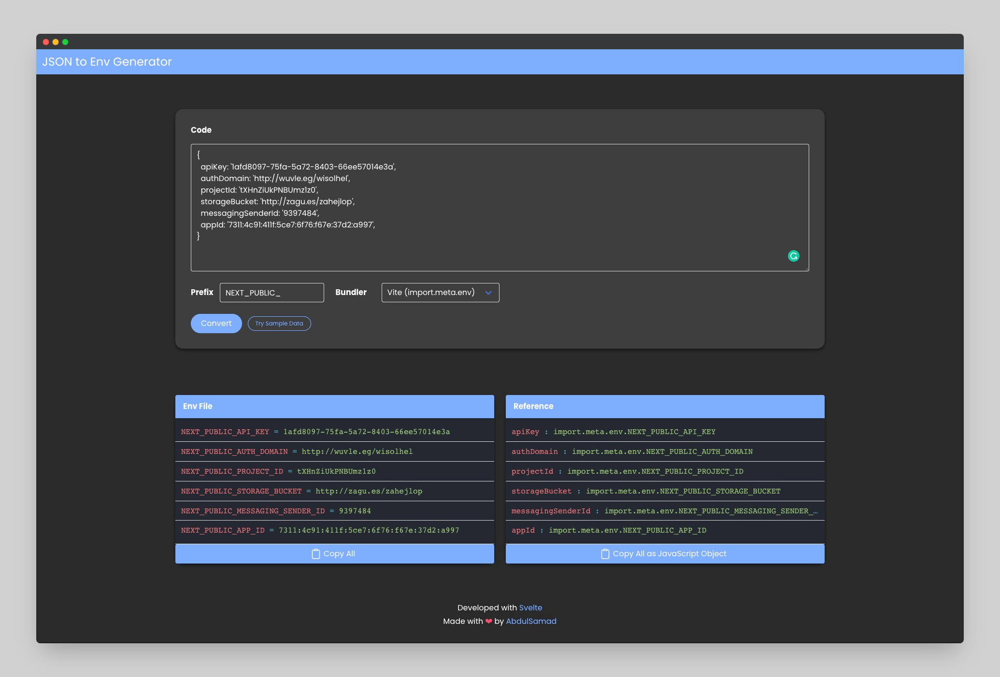

## JSON to Env Generator
 JSON to Env Generator provides an efficient solution for generating environment variables and references from JSON configs like Firebase config, making the development process simpler and error-free. It supports process.env and import.meta.env, giving users the flexibility to use either option. With its user-friendly interface, developers can quickly and easily generate the necessary environment variables and references, saving time and effort in their projects.

Completely rewritten from scratch using Svelte. Svelte is a modern JavaScript framework that allows us to build powerful, reactive web applications with minimal code.

